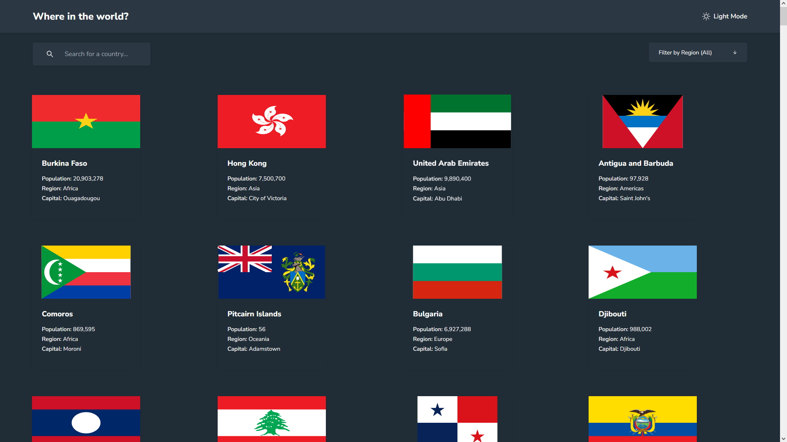

# Rest-Countries-API

  

# About

Discover the World with Rest-Countries-API! 🌐

I'm thrilled to share a project I've been working on recently! 🚀

🖥️ Explore Countries: I've built a comprehensive web app using React, TypeScript, and Tailwind CSS that lets you seamlessly search for any country and access concise information about it! Whether you're curious about the culture, population, or geographic location, this app has got you covered.

🔍 Detailed Insights at Your Fingertips: With just a few clicks, you can dive into specific country details, allowing you to gain insights into its currency, languages spoken, and even its neighboring countries.

🌓 Customizable Dark Mode: We understand preferences vary, so I've incorporated a sleek dark mode feature for comfortable browsing at any time of day or night.

# Getting Started

;

1. First of all you need to clone app repository from github:

```
https://github.com/Lazzzare/rest-countries-api-with-color-theme-switcher-React
```

2. Next step requires install all the dependencies.

```
npm install
```

3. Running the Project

```
npm run dev
```

# Link

- Live Site URL: [Live Site](https://ecommerce-product-page-lazzzare.vercel.app/)

# Built With

- _Vite_
- _React_
- _Typescript (TSX)_
- _TailwindCss_
- _React Hooks (useState, useEffect)_
- _framer-motion_
- _react-icons_
